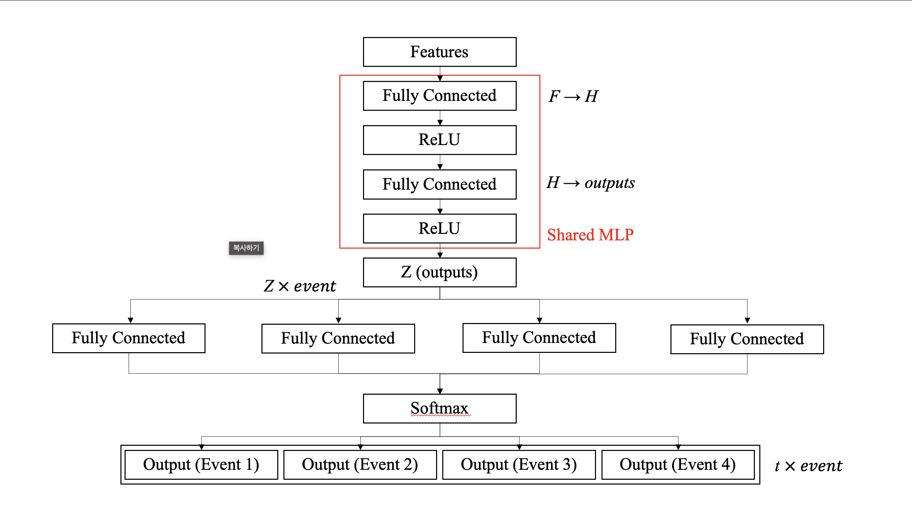

# **💉 암 환자 고위험군 및 사망률 예측**
---

## 1. **팀 소개**
### 🚑  응급디버깅실 (ER) 🚑
코드 터지면 바로 실려옴 💻

## 🧬 팀원 소개 
---
<table>
  <tr>
    <td align="center" width="200px">
      <br/>
      <b>박준영</b>
    </td>
    <td align="center" width="200px">
      <br/>
      <b>강지완</b>
    </td>
    <td align="center" width="200px">
      <br/>
      <b>김민정</b>
    </td>
    <td align="center" width="200px">
      <br/>
      <b>이승원</b>
    </td>
   <td align="center" width="200px">
      <br/>
      <b>박소희</b>
    </td>
  </tr>
  <tr>
    <td align="center" width="200px">
      <a href="https://github.com/deneb784"> GitHub</a>
    </td>
    <td align="center" width="200px">
      <a href="https://github.com/Maroco0109"> GitHub</a>
    </td>
    <td align="center" width="200px">
      <a href=https://github.com/MinJeung-Kim"> GitHub</a>
    </td>
    <td align="center" width="200px">
      <a href="https://github.com/seungwon-sw"> GitHub</a>
    </td>
     <td align="center" width="200px">
      <a href="https://github.com/xxoysauce"> GitHub</a>
    </td>
  </tr>
  
  
</table>


---

## 2. **프로젝트 개요**
---
### 2.1. 프로젝트 명
#### **암 환자 고위험군 및 이탈율 예측**

### 2.2. 프로젝트 주제 선정 배경
> 병원 관점에서 질병 환자의 **사망**은 단순한 의료적 사건이 아니라, **고객의 이탈(churn)** 과 유사한 개념으로 볼 수 있다.


- 완치율이 높은 병원은 환자의 신뢰를 얻어 재방문율이 높고, 새로운 환자 유입도 활발하다.
- 반면 사망률이 높은 병원은 환자의 신뢰 하락으로 인해 내원율이 감소하고, 기존 환자들이 다른 병원으로 이동하는 등 **고객 유지율(환자 유지율)** 이 떨어지는 경향을 보인다.

따라서 병원 경영 측면에서는 **고위험군 환자를 조기에 식별**하고, 치료 개입이나 관리 강화를 통해 위험을 완화하는 것이 매우 중요하다.
이는 단순한 질병 통계 분석을 넘어, 병원의 **서비스 지속성과 환자 관리 효율성**을 높이는 핵심 전략으로 기능한다.

### 2.3. 프로젝트 목적
본 프로젝트의 목적은 다음과 같다.

1. 암 환자의 시간에 따른 생존율 예측

- 생존 분석(Survival Analysis)을 통해 환자의 경과 시간에 따른 생존 확률을 추정한다.

2. 주요 사망 원인별 사망률 예측 및 생존 기간 산출

- 암 유형별·원인별로 사망 확률을 분석하여 환자의 예상 생존 기간을 예측한다.

3. 예측 기반 위험 점수(Risk Score) 산출

- 예측된 생존율을 바탕으로 환자별 위험도를 0~100점 범위로 정량화하고,
고위험군 환자를 직관적으로 식별할 수 있는 관리 지표를 제공한다.


---
## 3-1. **기술 스택**


|      **카테고리**     |                                                                                                                                                                                                                    **기술 스택**                                                                                                                                                                                                                    |
| :---------------: | :---------------------------------------------------------------------------------------------------------------------------------------------------------------------------------------------------------------------------------------------------------------------------------------------------------------------------------------------------------------------------------------------------------------------------------------------: |
|      **WEB**      |                                                                                                                                                                                                                                                                                                 |
|     **라이브러리**     |           |
| **개발 환경 및 협업 도구** |    |


## 3-2. **파일 구조**

```
TEAMPROJECT/
└─ SKN19_2ND_5TEAM/
   ├─ data/
   │  │
   │  ├─ 2022Data_part1.csv
   │  ├─ 2022Data_part2.csv
   │  ├─ categories_select.csv
   │  ├─ encoded_dataset_COD.csv
   │  ├─ encoded_dataset.csv
   │  ├─ Suicide_encode.csv
   │  ├─ Suicide.csv
   │  └─ test dataset.csv
   │
   ├─ insight/
   │  ├─ COD list.ipynb
   │  ├─ data_encode_insight_kmj.ipynb
   │  ├─ data_insight_kjw.ipynb
   │  ├─ data_insight_kmj.ipynb
   │  ├─ data_insight_lsw.ipynb
   │  ├─ EDA.ipynb
   │  └─ encoded_label_dump.txt
   │
   ├─ modules/
   │  ├─ __init__.py
   │  ├─ DataAnalysis.py
   │  ├─ DataModify.py
   │  ├─ DataSelect.py
   │  ├─ ModelAnalysis.py
   │  ├─ Models.py
   │  └─ smart_csv.py
   │
   ├─ parameters/
   │  ├─ categories.pkl
   │  ├─ deephit_model_2D_CNN.pth
   │  ├─ deephit_model_CNN.pth
   │  ├─ deephit_model_Concat.pth
   │  ├─ deephit_model_feature.pth
   │  └─ deephit_model_feature_original_Deephit.pth 
   │
   ├─ .gitignore
   ├─ Analysis.ipynb
   ├─ environment.yml
   ├─ pyproject.toml
   ├─ README.md
   ├─ run.py
   ├─ test.ipynb
   └─ train.ipynb

```

## 4. **WBS**
---

## 5. **데이터 전처리 및 EDA**
___


## 6. **인공지능 학습 결과서**
---

### 6-1. 기본 모델 아이디어
 해당 시스템은 환자에 대한 사망원인별 연속적인 사망률을 예측하여, 고위험 요인에 대한 선제적 조치와 예방을 목적으로 한다.  
 따라서 여러 시간대별 사망률을 예측할 수 있는 모델을 필요로 하고, 해당 형태를 구현하기 위하여 딥러닝 모델을 구현하여 사용하였다.  
 기본 모델의 형태와 손실함수는 *DeepHit: A Deep Learning Approach to Survival Analysis with Competing Risks.* (Lee, Changhee, et al., 2018)를 기반으로 작성하였다.  

 <div align="center">
  
  <br>
  <i> Deephit 모델의 기본 구조 </i>
</div>

  DeepHit모델은 특성을 공유 Branch와 각 사건별 Branch에 차례대로 통과시켜 이산화시킨 시간 별 사건 발생 확률을 예측하는 형태의 모델이다.

### 6-2. 모델 개선 아이디어
  Deephit 모델은 시간대별 사건 발생 확률을 예측하는 MLP 기반의 모델로, 학습 과정에 여러 모듈을 추가하여 성능 개선을 도모할 수 있다.

#### 6-2.1. SEBlock (Squeeze-and-Excitation Block)
  Standard Scaler를 이용한 스케일링 대신 모델에 *Squeeze-and-Excitation Networks* (Jie Hu, Li Shen, Gang Sun, 2018) 에서 사용된 SEBlock 아이디어를 단순 특성 MLP에 적용하여 Feature Weighting

#### 6-2.2. Residual Connection, Feature-wise Concat
  모델의 학습을 돕고 성능을 향상시키기 위하여 사용
   
  > 모델의 깊이가 깊지 않아 성능에 도움을 주지 않아 최종 모델에서는 사용하지 않음

#### 6-2.3. 1D, 2D CNN
  모델의 결과에 시간대별, 사건별 연관성을 추가하기 위하여 CNN을 사용

### **📊 모델별 학습 결과**

#### **모델 성능 평가 지표**
- Concordance Index (C-index) : 임의의 사건 두 개를 뽑아서 어떤 사건이 더 먼저 발생했는지 비교했을때, 해당 비교에 대한 정확도
- Integrated Brier Score (IBS) : 모델의 시간대별 오차 제곱의 평균 (MSE의 시간축에 대한 적분)


<table>
  <tr>
    <th>활용모델</th>
    <th>Concordance Index (C-index)</th>
    <th>Integrated Brier Score (IBS)</th>
    <th>MAE of predicted time</th>
    <th>Hyper parameters</th>
  </tr>
  <tr>
    <th scope="row" style="text-align:left;">SEBlock</th>
    <td>0.6412</td><td>0.2130</td><td>3.2790</td>
    <td>Hidden layer : (128, 64),<br> Time bins : 91,<br> SE ratio : 0.25</td>
  </tr>
  <tr>
    <th scope="row" style="text-align:left;">SEBlock + Feature concat</th>
    <td>0.5558</td><td>0.2463</td><td>4.6994</td>
    <td>Hidden layer : (128, 64),<br>  
      Time bins : 91,<br>  
      SE ratio : 0.25</td>
  </tr>
  <tr>
    <th scope="row" style="text-align:left;">SEBlock + 1-dimensional CNN</th>
    <td>0.7302</td><td>0.2116</td><td>3.6853</td>
    <td>Hidden layer : (128, 64),<br> Time bins : 91,<br> 
      SE ratio : 0.25,<br> CNN kernel size : 3</td>
  </tr>
  <tr>
    <th scope="row" style="text-align:left;">SEBlock + 2-dimensional CNN</th>
    <td>0.8263</td><td>0.2005</td><td>2.9128</td>
    <td>Hidden layer : (128, 64),<br> Time bins : 91,<br> SE ratio : 0.25,<br> CNN kernel size : (2, 5), (2,3)</td>
  </tr>
</table>


### 6-3. 최종 모델 형태

<div align="center">
  
  <br>
  <i> 최종 Deephit 모델 </i>
</div>


## 7. **수행 결과**
---

### 결론
---

## 8. **한줄 회고**

<table>
  <tr>
    <th style="width:80px;">이름</th>
    <th>회고 내용</th>
  </tr>
  <tr>
    <td>🧠 박준영</td>
    <td></td>
  </tr>
  <tr>
    <td>🌡️ 강지완</td>
    <td></td>
  </tr>
  <tr>
    <td>👩🏻‍⚕️ 김민정 </td>
    <td>
</td>
  </tr>
  <tr>
    <td>🧑🏻‍⚕️ 이승원</td>
    <td>
    </td>
  </tr>
  <tr>
    <td>🫀 박소희</td>
    <td></td>
  </tr>
</table>


